<!-- ░░░░░░░░░░░░░░░░░░░░  SAHAYAK  ░░░░░░░░░░░░░░░░░░░░ -->

<p align="center">
  
</p>

<p align="center">
  
</p>

<p align="center">
  
  
  
  
  
  
  
</p>

<p align="center">
  <a href="#-tldr">TL;DR</a> ·
  <a href="#-see-it-working">Demo</a> ·
  <a href="#%EF%B8%8F-architecture">Architecture</a> ·
  <a href="#-how-each-part-works">How it works</a> ·
  <a href="#-quick-start">Quick start</a> ·
  <a href="docs/SCALING.md">Scaling to 1cr+</a>
</p>

---

## ⚡ TL;DR

> A rural citizen lays their documents under a propped-up phone. They speak one answer in
> their own language. Out comes a **correctly-filled, submittable government application** — plus
> a checklist of what to attach, where to submit it, and **the schemes they didn't even know they
> qualified for.**

- 🎯 **Three jobs:** **Discover** what you're entitled to → **Execute** (fill the form) → **Track** the application.
- 🧠 **The LLM never decides eligibility.** A **deterministic rules-gate** (plain, auditable code) is the only thing that says "you qualify." The LLM only *explains*, *asks the next question*, and *maps fields*.
- 🔒 **Aadhaar-safe by design.** The 12-digit number is masked to last-4 **on the device** and **never stored**. DPDP-aligned consent + audit trail.
- 🟢🟡🔴 **Every value is traceable.** Tap any field to see where it came from; green = verified, amber = check, red = you told us. The operator only reviews amber + red.
- ✨ **The kicker:** "You came to renew a ration card — **you also qualify for an old-age pension you never asked about.**"
- 📱 + 🖥️ **Two full apps** (Flutter Android + Next.js web) on **one shared brain** (FastAPI), 7 Indian languages, runs with **zero API keys** (every external service has a realistic mock).

---

## 🎬 See it working

<p align="center">
  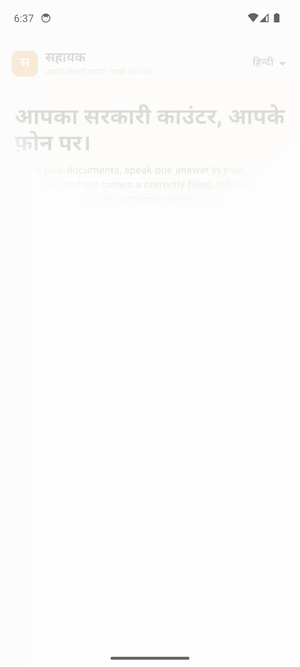
</p>

<p align="center"><b>▶︎ Full video:</b> <a href="docs/media/sahayak-demo.mp4">docs/media/sahayak-demo.mp4</a> &nbsp;·&nbsp; <i>Android app, live, in Hindi: capture → discover → fill → read-back → submittable PDF.</i></p>

### 🖥️ Web app

| Discover (entitlement graph) | Fill (provenance + tiers) | Submittable output |
|:--:|:--:|:--:|
| 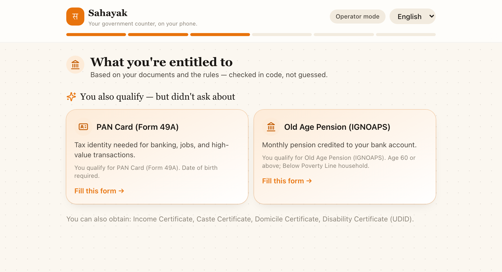 | 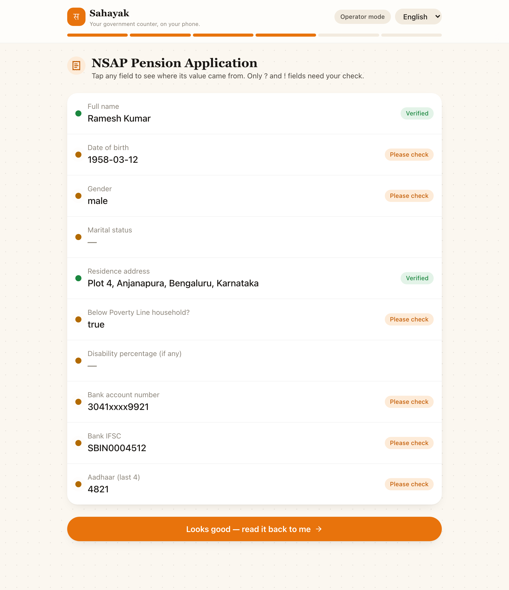 | 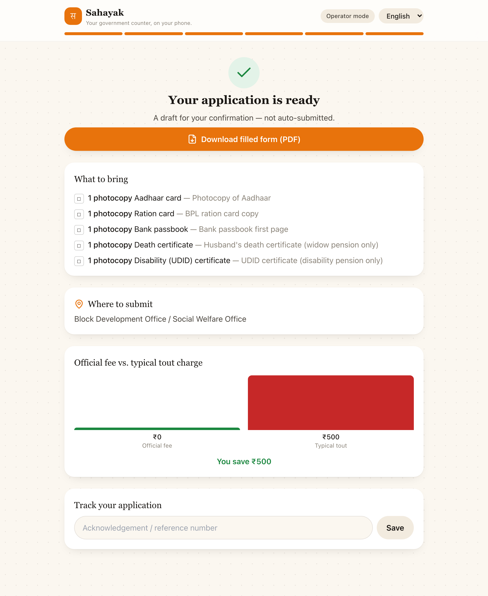 |
| **Cross-document consistency** | **Voice teach-back consent** | **Welcome / operator mode** |
| 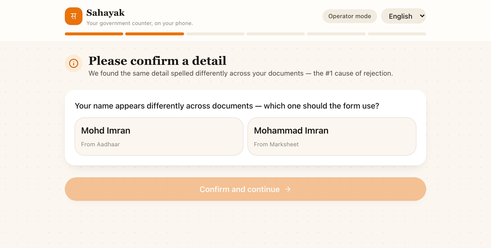 | 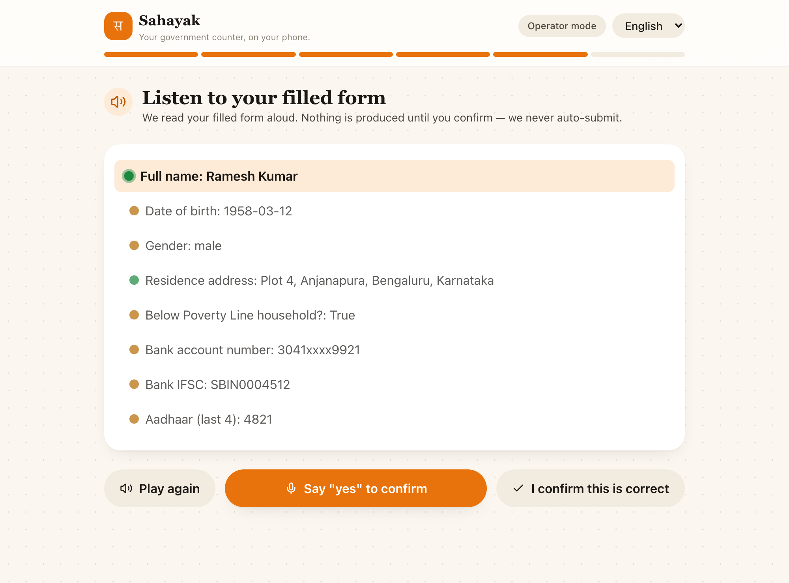 | 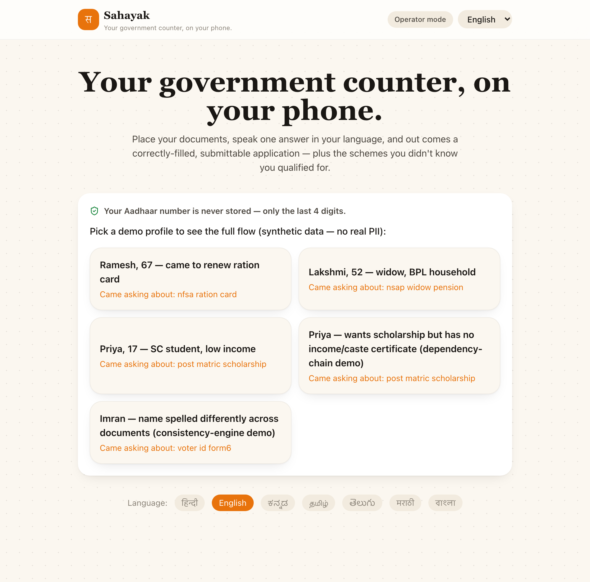 |

### 📱 Android app (Hindi)

<p align="center">
  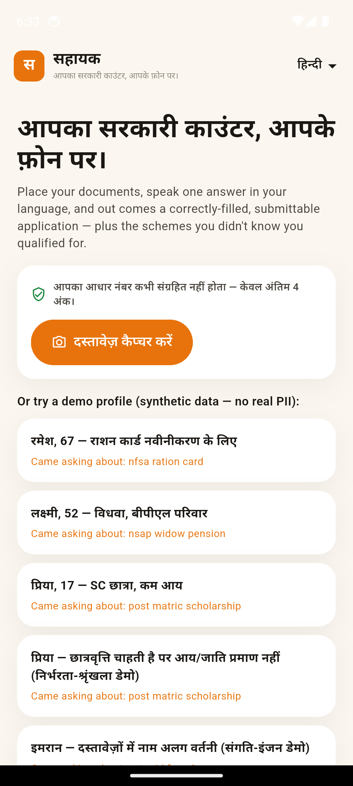
  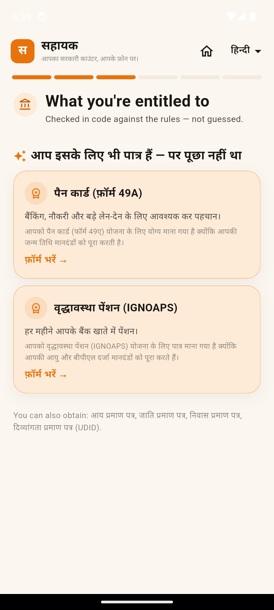
  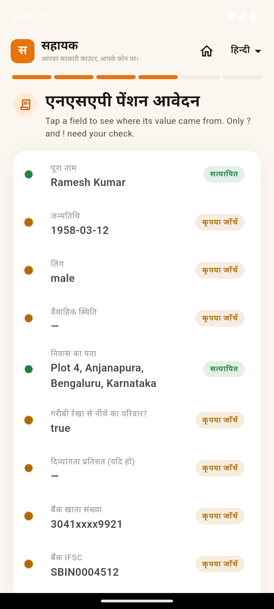
  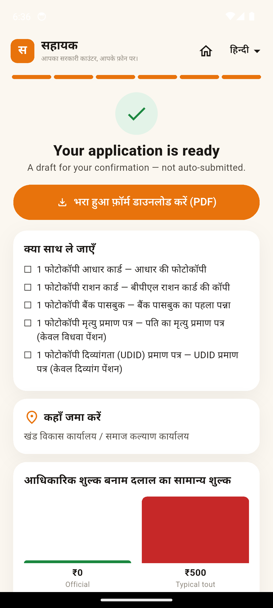
</p>

---

## 🏗️ Architecture

**One sentence:** the device does private work (capture, OCR, **PII masking before egress**); the cloud
*reasons and explains* but a **deterministic rules-gate decides**; forms are **data, not code**; every
output value carries **provenance**.

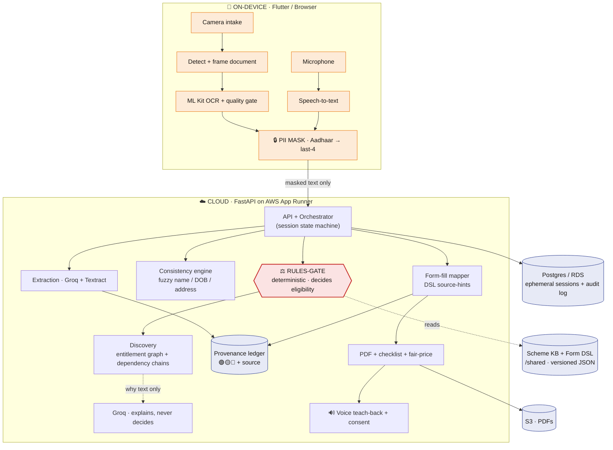

### End-to-end flow (the orchestrator state machine)

```mermaid
stateDiagram-v2
  direction LR
  [*] --> Capture
  Capture --> Extract: OCR + structure
  Extract --> Consistency: cross-check docs
  Consistency --> Converse: mismatch found
  Consistency --> Reason: all consistent
  Converse --> Reason: gaps filled by voice
  Reason --> SelectForm: rules-gate + discovery
  SelectForm --> Fill: bind facts → fields
  Fill --> TeachBack: read aloud
  TeachBack --> Output: verbal/tap consent ✅
  Output --> Track: reference no. + reminders
  Track --> [*]
```

---

## 🧩 How each part works

<details open>
<summary><b>⚖️ The deterministic rules-gate — the part that keeps us safe</b></summary>

<br/>

Eligibility is a legal/financial determination, so it is **never** left to the LLM. Each scheme
declares hard criteria as typed predicates evaluated in plain Python:

```python
Criterion(field="age",               op=">=", value=60)      # Old-age pension
Criterion(field="income",            op="<=", value=250000)  # Scholarship ceiling
Criterion(field="disability_percent",op=">=", value=40)      # Disability pension
```

The gate returns one of `QUALIFIES`, `DOES_NOT_QUALIFY`, `NEEDS_INFO` (a fact is missing), or
`NEEDS_PREREQUISITE` (a required document is *itself* an application → feeds the dependency-chain).
The LLM is handed the **result** and asked only to phrase the human "why." It can't change the verdict.
→ [`backend/app/engine/rules.py`](backend/app/engine/rules.py)

</details>

<details>
<summary><b>📄 Forms are data, not code — the declarative DSL</b></summary>

<br/>

State forms vary endlessly, so they're described as **versioned JSON**, not hardcoded. A field declares
its type, validations, localized labels, and **`source_hints`** — where to look for its value:

```jsonc
{ "key": "dob", "type": "date", "required": true,
  "source_hints": ["aadhaar.dob", "marksheet.dob"],   // bind deterministically, LLM only as fallback
  "validations": ["pastDate", "age>=18"] }
```

`attachments` drives the checklist generator; `submit_to.online_wall` tells the app where to hand off
honestly (biometrics/OTP/appointment). Add a scheme/form by dropping a file in
[`/shared`](shared/) — no redeploy. → [`shared/forms`](shared/forms) · [`shared/schemes`](shared/schemes)

</details>

<details>
<summary><b>🟢🟡🔴 Provenance & confidence tiers</b></summary>

<br/>

Every filled value stores `{value, source_type, source_ref, confidence_tier, captured_at}`.

- **🟢 Green** — read directly from a document **and** cross-verified across documents.
- **🟡 Amber** — inferred, or single-source / low OCR confidence.
- **🔴 Red** — user-spoken & unverifiable (income, "no existing connection").

The human-in-the-loop only reviews **amber + red** — which is what makes review fast instead of pointless.
→ [`backend/app/engine/provenance.py`](backend/app/engine/provenance.py)

</details>

<details>
<summary><b>🔍 Cross-document consistency engine</b></summary>

<br/>

The #1 cause of rejected applications is name/DOB/address mismatches across documents. The engine
fuzzy-matches shared fields and surfaces a "which should the form use?" — catching *"Mohd Imran" on Aadhaar
vs "Mohammad Imran" on the marksheet* **before** submission. → [`backend/app/engine/consistency.py`](backend/app/engine/consistency.py)

</details>

<details>
<summary><b>✨ Discovery — the entitlement graph & dependency chains</b></summary>

<br/>

The rules-gate runs over the **whole** scheme catalog, not just what the user asked for, and ranks results.
It surfaces schemes you didn't ask about (the dignity multiplier) and detects when a scheme needs a
certificate that is *itself* an application ("this scholarship needs an income certificate you don't have yet
→ here's how to get that first"). An honest **discovery gate** stops it suggesting, say, a disability pension
to everyone. → [`backend/app/engine/discovery.py`](backend/app/engine/discovery.py)

</details>

<details>
<summary><b>🔌 Adapters — runs with zero credentials</b></summary>

<br/>

Every external service (Groq, AWS Textract/Transcribe/Polly, Bhashini, S3, Cognito) implements a small
interface with a **real client + a realistic mock**, selected by env var. That's why the whole system
boots and demos before any key exists, and why swapping Groq→Gemini or Textract→Vision is a one-file change.
A live key-checker (`backend/validate_keys.py`) makes real calls and reports ✅/❌ per provider.
→ [`backend/app/services`](backend/app/services)

</details>

<details>
<summary><b>📱 On-device privacy (Flutter)</b></summary>

<br/>

Document classification + OCR (ML Kit), Aadhaar masking, and voice (ASR/TTS) run **on the phone**. Only
masked, structured fields ever leave the device. → [`mobile/lib/services`](mobile/lib/services)

</details>

<details>
<summary><b>🖥️ Web + 🏗️ Infra</b></summary>

<br/>

The **Next.js** web app (Framer Motion animations, 7-language switcher, operator mode) talks to the same
FastAPI brain. **Terraform** provisions a cost-aware AWS stack (App Runner, RDS Postgres, S3, Cognito,
Secrets Manager) and **GitHub Actions** build/push images + an Android APK artifact.
→ [`web`](web) · [`infra`](infra) · [`.github/workflows`](.github/workflows)

</details>

---

## 🛠️ Tech stack

| Layer | Choice | Why |
|---|---|---|
| 📱 Mobile | **Flutter** | One codebase, great camera + on-device ML Kit, premium animations |
| 🖥️ Web | **Next.js 14 · TS · Framer Motion** | SSR, animated UI, single-origin API proxy |
| 🧠 Backend | **Python · FastAPI · SQLAlchemy** | Ideal for the rules engine + document pipelines |
| 🗄️ DB | **PostgreSQL** (AWS RDS) | Relational fit for DSL, rules, provenance, household graph |
| 💬 Reasoning | **Groq** (OpenAI-compatible) | Fast multilingual explanations — *gated by deterministic rules* |
| 👁️ OCR | **ML Kit on-device + AWS Textract** | Privacy + latency on-device; accuracy in cloud |
| 🔊 Voice | **Bhashini + AWS Transcribe/Polly** | India's national language stack |
| ☁️ Infra | **AWS · Terraform · GitHub Actions** | Reproducible, cost-aware |

---

## 🚀 Quick start

```bash
# 1) Backend (Python 3.12) — works fully on mocks with zero keys
cd backend && python3.12 -m venv .venv && source .venv/bin/activate
pip install -r requirements.txt
cp .env.example .env                 # optional: add GROK/AWS/Bhashini keys
uvicorn app.main:app --reload        # http://localhost:8000  (docs at /docs)
python smoke_test.py                 # full flow across all demo personas ✅

# 2) Web
cd ../web && npm install && npm run dev     # http://localhost:3000

# 3) Android (needs Flutter + an emulator/device)
cd ../mobile && flutter pub get && flutter run   # talks to 10.0.2.2:8000

# 4) Everything at once (Docker)
docker compose up --build            # Postgres + API + Web
```

> 🔑 **Live services:** drop keys into `backend/.env` and run `python validate_keys.py` to confirm them
> with real calls. Without keys, every adapter uses a deterministic mock and the full flow still runs.

---

## 📁 Repository layout

```
Sahayak/
├── backend/      FastAPI brain — rules-gate, consistency, provenance, discovery, PDF, orchestrator
├── web/          Next.js animated web app (voice-first, operator + self-serve)
├── mobile/       Flutter Android app (camera, on-device OCR/PII, voice)
├── shared/       Source of truth: scheme KB + form DSL + 7-language strings (JSON)
├── infra/        Terraform — AWS (App Runner, RDS, S3, Cognito, Secrets)
├── docs/         ARCHITECTURE.md · SCALING.md (path to 1cr+ users) · media/
└── .github/      CI/CD (tests, image build/push, Android APK)
```

---

## 🔐 Safety & compliance

- **Aadhaar Act** — full 12-digit number masked to last-4 **on-device**, never persisted; no central honeypot.
- **DPDP Act 2023** — ephemeral-by-default sessions, explicit verbal/tap consent, full audit trail of what was read / asked / confirmed.
- **Never auto-submits** — always a draft the user confirms via voice teach-back first.
- **Honest about limits** — database-gated eligibility (PM-JAY/SECC) and online-only walls are *prepared up to the wall* and handed off, never faked.

---

## 📈 Scaling to 1 crore+ (10M+) users

The MVP is a modular monolith that decomposes cleanly: queue the heavy OCR/LLM/PDF work, go
**on-device-first** to crush the AI cost curve, cell-split by region, and keep the deterministic
rules-gate as the sole eligibility authority at any scale. Full plan, cost model, and rollout in
**[`docs/SCALING.md`](docs/SCALING.md)**.

---

<p align="center">
  
</p>
